# DFN Database Schema (Comprehensive)

## Entity Relationship Overview

This schema represents the entire DFN Discovery product, including the core matching engine components, the Multi-Stage Process Routing DAG system, the Standards & SDO Ingestion Architecture, and the proxy architecture for external SaaS auditing (UpKeep/SafetyCulture).

```mermaid
erDiagram
    batch_manifests ||--o{ jobs : "groups (software async batching)"
    jobs ||--o{ recommendations : "generates single-facility"
    jobs ||--o{ cluster_recommendations : "generates multi-facility chain"
    jobs ||--o{ attachments : "includes"
    jobs ||--o{ job_queue : "enqueues"
    jobs ||--o{ process_stages : "contains DAG nodes"
    jobs ||--o{ process_transitions : "contains DAG edges"
    jobs ||--o{ stage_compliance_specs : "mandates standards"
    
    factories ||--o{ recommendations : "matches with"
    factories ||--o{ site_assessments : "audited via"
    factories ||--o{ factory_certifications : "holds accredited"
    job_queue ||--o{ site_assessments : "updates via async webhook"

    standards_catalog ||--o{ standard_cross_references : "source standard"
    standards_catalog ||--o{ standard_cross_references : "target standard"
    standards_catalog ||--o{ factory_certifications : "verifies"
    standards_catalog ||--o{ stage_compliance_specs : "referenced in"

    batch_manifests {
        uuid id PK
        string org_id "NOT NULL, indexed"
        string status "pending, processing, completed, failed"
        string idempotency_key "unique"
        jsonb metadata
        timestamp created_at
        timestamp updated_at
    }

    jobs {
        uuid id PK
        string org_id "NOT NULL, indexed — owning organisation"
        string created_by "NOT NULL — userId from JWT"
        uuid batch_id FK "nullable — linked to batch_manifests"
        string company_name
        string product_name
        string process_type "Legacy single-stage or summary"
        string material_type "Legacy single-stage or primary alloy"
        string volume_band
        jsonb location
        string status "draft, submitted, analyzing, scored, recommended, published"
        int version
        jsonb metadata
        timestamp created_at
        timestamp updated_at
    }

    process_stages {
        uuid id PK
        uuid job_id FK
        string org_id "NOT NULL, indexed"
        int stage_order "1-indexed sequence"
        string operation_type "forming, cnc_milling, heat_treat, anodizing, ndt"
        jsonb substrate_spec "alloy grade, temper (6061-T6), form factor, MTC required"
        jsonb tooling_spec "kinematics, axes, feeds, speeds, fixtures"
        jsonb tolerances "linear tolerances, Ra surface roughness"
        jsonb quality_checks "NDT, CMM, hardness testing"
        timestamp created_at
    }

    process_transitions {
        uuid id PK
        uuid job_id FK
        uuid from_stage_id FK
        uuid to_stage_id FK
        string org_id "NOT NULL, indexed"
        string transition_type "internal_transfer, inter_fab_transit"
        string preservation_rule "vci_bag, oil_dip, crating, desiccant"
        int max_queue_time_hours "maximum delay before material degradation"
        timestamp created_at
    }

    factories {
        uuid id PK
        string org_id "NULL = platform-managed; set = org-private"
        string factory_name
        jsonb capabilities "processes, machine classes, spindle speeds, axis counts"
        jsonb materials "supported alloys, tempers, polymers"
        string capacity_band
        jsonb locations
        jsonb certifications "legacy array"
        jsonb verified_sources
        boolean active
        string external_factory_id "Used as tag in SafetyCulture/UpKeep"
        timestamp created_at
        timestamp updated_at
    }

    standards_catalog {
        uuid id PK
        string sdo "ISO, SON, ASTM, ASME, API, DIN, BSI, NACE, AWS"
        string standard_code "e.g. NIS 102:2006, ASTM A36, API 5L"
        string title
        string category "materials, welding, quality, pressure_vessels, coatings"
        string status "active, withdrawn, under_revision"
        string scope_summary
        string ics_code "International Classification for Standards"
        jsonb metadata
        timestamp published_date
        timestamp updated_at
    }

    standard_cross_references {
        uuid id PK
        uuid source_standard_id FK
        uuid target_standard_id FK
        string equivalence_level "identical, modified, equivalent_substitute"
        string technical_notes
        jsonb property_mapping
    }

    factory_certifications {
        uuid id PK
        uuid factory_id FK
        uuid standard_id FK
        string certificate_number
        string certification_body "SON, SGS, DNV, Bureau Veritas"
        string iaf_certsearch_id "nullable - linked to IAF live validation"
        boolean is_iaf_verified
        timestamp issued_at
        timestamp expires_at
        string verification_status "verified, unverified, expired"
    }

    stage_compliance_specs {
        uuid id PK
        uuid job_id FK
        uuid stage_id FK "nullable — stage-specific or job-wide"
        uuid standard_id FK
        boolean is_mandatory "True = hard gating constraint"
        string inspection_method "MTC, NDT, dimensional_audit, third_party"
    }

    recommendations {
        uuid id PK
        uuid job_id FK
        uuid factory_id FK
        string org_id "NOT NULL, indexed"
        int fit_score
        int feasibility_score
        int confidence_score
        int rank
        jsonb evidence
        jsonb caveats
        timestamp generated_at
        int version
    }

    cluster_recommendations {
        uuid id PK
        uuid job_id FK
        string org_id "NOT NULL, indexed"
        int headline_fit_score "Weighted geometric mean + logistics penalty"
        int chain_feasibility_score
        int total_landed_cost_ngn "Cumulative operations + freight + preservation"
        int total_lead_time_days "Processing time + inter-fab transit latency"
        jsonb stage_assignments "Array of stage IDs mapped to factory IDs & stage scores"
        jsonb inter_fab_logistics "Transit legs, HERE route metrics, road risk, packaging"
        jsonb caveats
        timestamp generated_at
        int version
    }

    attachments {
        uuid id PK
        uuid job_id FK
        string org_id "NOT NULL, indexed — must match job.org_id"
        string storage_key "Opaque UUID — never the original filename"
        string mime_type
        int size_bytes
        string source_type
        timestamp uploaded_at
    }

    site_assessments {
        uuid id PK
        uuid factory_id FK
        string safetyCulture_audit_id "Tagged on master vendor account"
        string upkeep_work_order_id "Tagged on master vendor account"
        int max_capacity_units "Strict metrics (dropdowns only)"
        int equipment_age_score "0-100 heuristic"
        boolean passed_inspection "Directly drives UpKeep WO triggers"
        jsonb raw_webhook_payload "Audit trail and AI extraction source"
        timestamp assessed_at
    }

    job_queue {
        uuid id PK
        uuid job_id FK "nullable"
        string queue_type "classify-job, sync-audit-webhook, sync-son-standards, score-process-chain"
        jsonb payload "Raw webhook, analysis data, or sync parameters"
        string status "pending, processing, completed, failed"
        jsonb result
        int attempts
        string error
        timestamp created_at
        timestamp updated_at
        timestamp completed_at
    }
```

---

## Constraints and Conventions

1. **Software Async Batching vs Manufacturing Lot Planning**:
   - `batch_manifests` is the software API control plane for bulk uploads (e.g. 50 jobs submitted in a single API call).
   - Manufacturing batching (minimum lot sizes, setup amortisation, machine changeover costs) is modeled as mathematical parameters in `process_stages.tooling_spec` and `cluster_recommendations.total_landed_cost_ngn`.

2. **Multi-Stage Process Routing (DAGs)**:
   - Jobs can either use the flat single-stage fields (`process_type`, `material_type`) for simple queries, or define a rich DAG through `process_stages` (nodes) and `process_transitions` (edges).
   - `process_transitions.preservation_rule` and `max_queue_time_hours` dictate intermediate WIP handling and tropical humidity corrosion protection during inter-fab transfer.

3. **Standards Cross-Referencing & Gating**:
   - `standards_catalog` contains normalized metadata from 25 SDOs (ISO, SON/NIS, ARSO, ASTM, ASME, API, etc.).
   - `standard_cross_references` allows automatic equivalency resolution (e.g. mapping European `EN 10025-2 S275` to Nigerian `NIS 102` or American `ASTM A36`).
   - `stage_compliance_specs.is_mandatory = true` creates a strict feasibility gate in the scoring engine.

4. **Multi-Tenancy (`org_id`)**:
   - Every user-owned table carries `org_id NOT NULL`.
   - Global catalog tables (`standards_catalog`, `standard_cross_references`) and platform-managed factory baselines are platform-wide read-only resources accessible to all tenants.

5. **Attachment Storage Security**:
   - `attachments.storage_key` is an opaque UUID. Original filenames are never used directly as cloud object keys. Signed URLs carry a maximum 15-minute TTL.