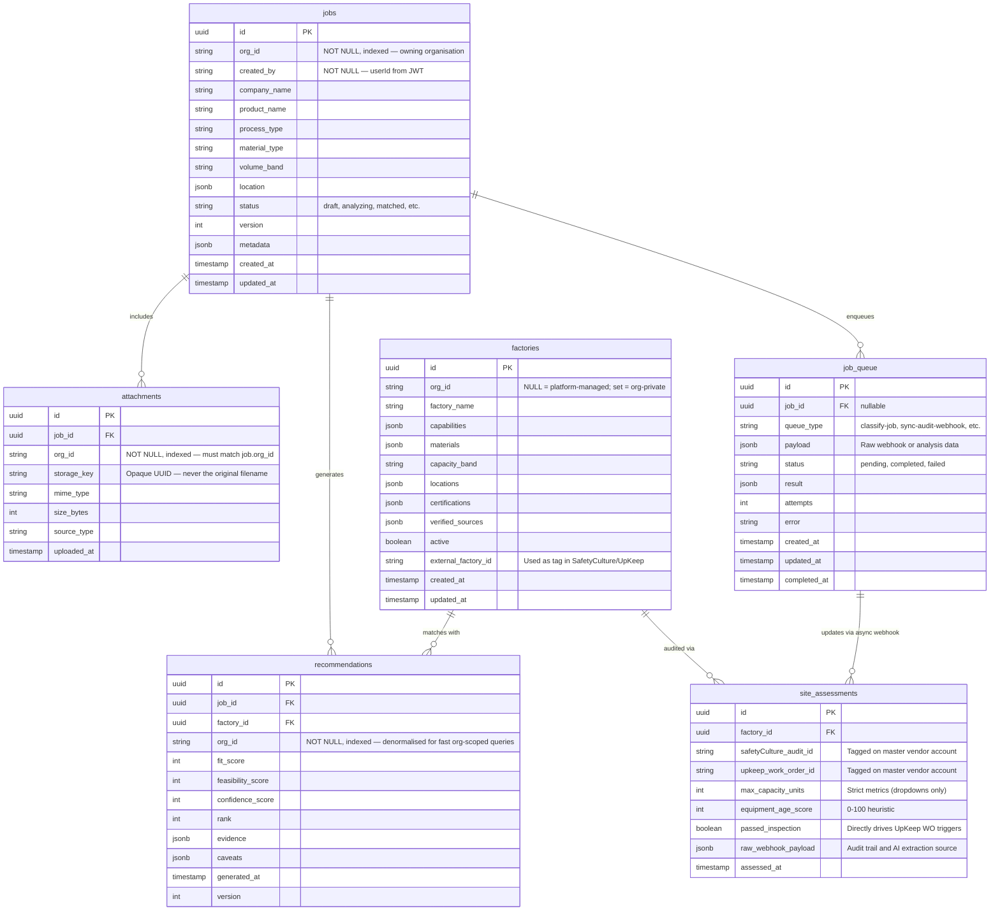

# DFN Database Schema (Comprehensive)

## Entity Relationship Overview

This schema represents the entire DFN Discovery product, including the core matching engine components (Jobs, Recommendations, Attachments) alongside the Phase 4 proxy architecture for external SaaS mapped auditing (UpKeep/SafetyCulture) via isolated backend representations.

### Constraints and Conventions

1. **Geo/Market Intelligence Isolation**: Third-party SaaS tools map against the `factories` table via `external_factory_id`. Auditors do not access internal UUIDs.
2. **`passed_inspection`**: In `site_assessments`, this boolean determines the branching outcome for triggering UpKeep Work Orders automatically via the async queue.
3. **`raw_webhook_payload`**: Essential to preserve full safety audit streams as JSONB so AI extraction workers can re-process historical qualitative fields at a later date.
4. **Queue Resilience**: The `job_queue` acts as a shock absorber. External inbound webhooks map to `job_queue` records immediately before complex processing to prevent timeouts. Internal async paths (like AI scoring in `recommendations`) also rely on this queue.
5. **Multi-Tenancy (`org_id`)**: Every table except `site_assessments` (which is factory-scoped, not org-scoped) carries an `org_id NOT NULL` column. This column is derived from the authenticated JWT on every write and applied as a mandatory filter on every read, update, and delete. The application never performs cross-org joins. Queries that return no row because of an `org_id` mismatch must surface as `404 Not Found` — never `403 Forbidden`. See [DFN_SECURITY.md](DFN_SECURITY.md) for the full multi-tenancy specification.
6. **Attachment Storage Keys**: The `attachments.storage_key` field is an opaque UUID used as the object storage key. The original filename is never used as a storage key to prevent path traversal and enumeration attacks. Signed URLs for attachment access carry a maximum 15-minute TTL.