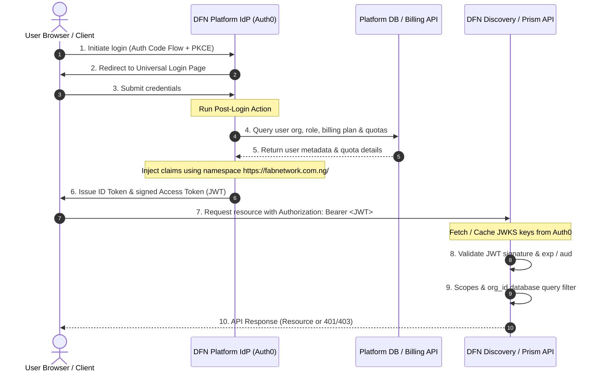

# DFN Platform Identity Provider (IdP) Design & Configuration Specification

**Status:** Approved Reference  
**Audience:** Platform Engineers, Security Team, Implementing Models  
**Scope:** DFN Platform-side Identity Provider (Auth0) configuration & integration boundary  
**Related Docs:** [DFN_SECURITY.md](file:///c:/Users/HP/OneDrive%20-%20COVENANT%20UNIVERSITY%20COMMUNITY/GitHub/dfn-discovery/docs/DFN_SECURITY.md), [DFN_MAIN_REPO_INTEGRATION.md](file:///c:/Users/HP/OneDrive%20-%20COVENANT%20UNIVERSITY%20COMMUNITY/GitHub/dfn-discovery/docs/DFN_MAIN_REPO_INTEGRATION.md)

---

## 1. Executive Summary

This document serves as the absolute implementation guide for setting up the DFN Platform's centralized Identity Provider (IdP).

### The Core Architectural Rule
>
> **Downstream services (Discovery, Prism, etc.) do not own identity. They trust identity.**
> Services must validate identity statelessly using JSON Web Key Sets (JWKS) and enforce local authorization based on custom claims injected into the JSON Web Token (JWT) by the IdP.

---

## 2. Authentication & System Architecture

The following diagram illustrates how the DFN Platform clients, the centralized IdP (Auth0), and the downstream services (Discovery/Prism) interact.



---

## 3. Auth0 Tenant Configuration Specifications

The implementing developer/model must set up the following entities in the Auth0 Tenant.

### 3.1 Tenant Settings

* **Custom Domain:** Recommended `auth.fabnetwork.com.ng` (to avoid third-party cookie blocking issues and preserve branding).
* **Allowed Logout URLs:** `https://*.fabnetwork.com.ng` (and `http://localhost:*` in development).

### 3.2 Application 1: DFN Frontend (Single Page Application - SPA)

* **Application Type:** Single Page Web Application.
* **Grant Types:** `Authorization Code`, `Refresh Token`.
* **PKCE:** Enabled (mandatory, do not use implicit flow).
* **Token Rotation:** Enable Refresh Token Rotation with a **sliding window of 7 days** and a **reuse leeway of 30 seconds** (to prevent race conditions in flaky networks).
* **Allowed Callback URLs:** `https://*.fabnetwork.com.ng/callback`, `http://localhost:3000/callback`.

### 3.3 Application 2: DFN Discovery M2M (Machine-to-Machine)

* **Application Type:** Non-Interactive (Machine-to-Machine).
* **Token Endpoint Auth Method:** `Post` or `Client Secret Basic`.
* **Purpose:** Allows Discovery to call other platform APIs (e.g., Billing Service or Prism) proactively using a short-lived client credentials token.

### 3.4 API Definitions (Resource Servers)

Define the following APIs in Auth0 to enable audience-restricted access tokens:

#### DFN Platform API

* **Identifier (Audience):** `https://api.fabnetwork.com.ng`
* **Signing Algorithm:** `RS256`

#### DFN Discovery API

* **Identifier (Audience):** `dfn-discovery` (Matches `AUTH_AUDIENCE` env variable in Discovery).
* **Signing Algorithm:** `RS256`
* **Token Lifetime (Access Token):** **900 seconds (15 minutes)**. *This short lifetime limits quota claim drift without overloading token-refresh endpoints.*

---

## 4. Custom Token Claims & Namespace

Auth0 requires custom claims to be prefixed with a URL-formatted namespace. The official namespace is:
`https://fabnetwork.com.ng/`

Downstream services will extract these claims to enforce multi-tenant isolation and rate limit checks.

### 4.1 Claim Schema & TS Interface

```typescript
export type OrgRole = 'owner' | 'admin' | 'member' | 'viewer';
export type PlanTier = 'free' | 'team' | 'business' | 'enterprise';

export interface QuotaClaims {
  jobsRemaining: number;      // Jobs remaining in current billing period
  batchSizeLimit: number;     // Max child jobs per batch submission
  apiCallsRemaining: number;  // Total API calls left in billing period
}

export interface DFNTokenClaims {
  // Standard JWT Claims
  sub: string;                // Unique User ID (e.g., 'auth0|64ba89e...')
  iss: string;                // Issuer (e.g., 'https://auth.fabnetwork.com.ng/')
  aud: string;                // Audience (e.g., 'dfn-discovery')
  exp: number;                // Expiry timestamp (Unix timestamp)
  iat: number;                // Issued-at timestamp (Unix timestamp)

  // Custom Claims (https://fabnetwork.com.ng/ namespace)
  'https://fabnetwork.com.ng/orgId': string;          // Organization ID (e.g., 'org_dfn10293')
  'https://fabnetwork.com.ng/orgRole': OrgRole;       // Role inside the organization
  'https://fabnetwork.com.ng/plan': PlanTier;         // Billing tier
  'https://fabnetwork.com.ng/quotas': QuotaClaims;    // Remaining quota allocations
  'https://fabnetwork.com.ng/features': string[];     // Array of feature flag strings
}
```

---

## 5. Auth0 Post-Login Action (Implementation Code)

To inject the custom claims, create an Auth0 **Post-Login Action** in the Auth0 Dashboard under **Actions > Library**.

Below is the complete Node.js code for the Action. It retrieves organization and quota details from the Platform Database / API and injects them into the JWT:

```javascript
/**
* Handler that runs post-login.
*
* @param {Event} event - Details about the user login context.
* @param {PostLoginAPI} api - Interface for modifying Auth0 behaviors.
*/
exports.onExecutePostLogin = async (event, api) => {
  const axios = require('axios');
  const namespace = 'https://fabnetwork.com.ng/';

  // 1. Establish Identity and Organization Context
  // Auth0 Organizations are preferred. Fallback to app_metadata if not logged in via an Auth0 Org.
  const orgId = event.organization ? event.organization.id : (event.user.app_metadata.orgId || null);
  const orgRole = event.organization 
    ? (event.organization.roles && event.organization.roles[0]) 
    : (event.user.app_metadata.orgRole || 'viewer');

  if (!orgId) {
    // If the user belongs to no organization, we reject the login.
    return api.access.deny('Access denied: You must be associated with an organization to log in.');
  }

  // 2. Fetch Billing Plan & Quotas from DFN Platform Service
  // We make a secure internal call to our database or billing API (e.g., Stripe sync service).
  // Use a secret stored in Auth0 Action Settings for authorization.
  let plan = 'free';
  let quotas = {
    jobsRemaining: 10,
    batchSizeLimit: 2,
    apiCallsRemaining: 100
  };
  let features = [];

  try {
    const platformApiUrl = event.secrets.DFN_INTERNAL_API_URL || 'https://api.fabnetwork.com.ng';
    const apiKey = event.secrets.DFN_INTERNAL_API_KEY;

    if (apiKey) {
      const response = await axios.get(`${platformApiUrl}/internal/orgs/${orgId}/entitlements`, {
        headers: {
          'Authorization': `Bearer ${apiKey}`,
          'Accept': 'application/json'
        },
        timeout: 2000 // 2 seconds strict timeout to avoid delaying logins
      });

      if (response.data) {
        plan = response.data.plan || plan;
        quotas = response.data.quotas || quotas;
        features = response.data.features || features;
      }
    } else {
      // Fallback: Read from Auth0 App Metadata if API key is not configured
      plan = event.user.app_metadata.plan || plan;
      quotas = event.user.app_metadata.quotas || quotas;
      features = event.user.app_metadata.features || features;
    }
  } catch (error) {
    console.error('Failed to fetch org entitlements, falling back to basic/cached metadata:', error.message);
    // In case of platform failure, fall back to safe cached app_metadata values to preserve availability
    plan = event.user.app_metadata.plan || plan;
    quotas = event.user.app_metadata.quotas || quotas;
    features = event.user.app_metadata.features || features;
  }

  // 3. Set Custom Claims on Access Token
  api.accessToken.setCustomClaim(`${namespace}orgId`, orgId);
  api.accessToken.setCustomClaim(`${namespace}orgRole`, orgRole);
  api.accessToken.setCustomClaim(`${namespace}plan`, plan);
  api.accessToken.setCustomClaim(`${namespace}quotas`, quotas);
  api.accessToken.setCustomClaim(`${namespace}features`, features);
};
```

---

## 6. Machine-to-Machine (M2M) Authentication

For service-to-service calls (e.g., when Discovery makes a call to the main Platform API or Billing Service), the client credentials grant is used.

### Configuration Rules

1. **Never Forward User Tokens:** Downstream services must never forward a user's web token for background worker/cron operations.
2. **Issue Specific Scopes:** M2M client credentials must request specific scopes required for the target operation (e.g. `write:audit-events`, `read:billing-status`).
3. **Caching:** The requesting service (e.g., Discovery) must cache the M2M access token in Redis (or in-memory cache) for its lifetime (`expires_in` minus a safety buffer of 60 seconds) to avoid querying Auth0's `/oauth/token` endpoint on every call.

---

## 7. Token Verification & Consumer Middleware Guidelines

Every consumer service API (such as Discovery or Prism) must implement an authentication middleware conforming to the following verification pipeline.

### Verification Flow for Consumers

1. **Extraction:** Read `Authorization` header. Format must match `Bearer <JWT_TOKEN>`.
2. **Signature Verification:**
   * Do not make a network request to Auth0 to validate the token on every request.
   * Download the signing keys from the JWKS endpoint: `https://<tenant>.auth0.com/.well-known/jwks.json`.
   * **Cache the JWKS keys locally** (recommended cache duration: 24 hours).
   * **Key Rotation Safeguard (Anti-DoS)**: If a token presents an unknown Key ID (`kid`), do not immediately fetch keys from Auth0. Enforce a debounced JWKS reload threshold (maximum once per 5 minutes) to protect the endpoint from key-flooding Denial of Service attacks. Reject the token immediately if it cannot be verified and the debouncing limit prevents a fresh keys reload.
3. **Claims Validation:**
   * Confirm the `iss` matches `AUTH_ISSUER_URL`.
   * Confirm the `aud` matches `AUTH_AUDIENCE` (e.g. `dfn-discovery`).
   * Verify the token is active: `exp > currentTime` and `nbf <= currentTime`.
4. **Context Injection:** Parse the custom claims and inject them into the local thread or request context (e.g. `res.locals.auth` in Express/TS).

---

## 8. Webhook Notifications for Multi-Tenant Provisioning

When an organization's subscription changes, the Platform Billing Service must propagate this state to downstream services.

### Upgrade Webhook Schema

When an organization upgrades to the **Enterprise** tier, a webhook must be sent to DFN Discovery to provision a dedicated database schema:

* **Endpoint:** `POST https://discovery.fabnetwork.com.ng/webhooks/provision-org`
* **Auth:** HMAC-SHA256 signature in `x-dfn-platform-signature` header using a shared webhook secret.
* **Payload:**

```json
{
  "eventId": "evt_9083109283",
  "eventType": "org.plan.upgraded",
  "orgId": "org_dfn10293",
  "newPlan": "enterprise",
  "oldPlan": "team",
  "timestamp": "2026-07-11T16:42:00Z"
}
```

Upon receipt, Discovery will immediately validate the signature, log the event, enqueue a schema-provisioning job into the BullMQ background queue, and return a `202 Accepted` response. The background queue worker will create the PostgreSQL schema named `org_<orgId>` and run the database migration scripts asynchronously to avoid blocking the event loop or causing HTTP request timeouts.

---

## 9. Next Steps for Implementation

The implementing developer/model must:

1. Configure the Auth0 applications and resource server APIs.
2. Deploy the Post-Login Action code inside Auth0.
3. Configure the secrets (`DFN_INTERNAL_API_URL`, `DFN_INTERNAL_API_KEY`) within the Auth0 Action dashboard.
4. Set the corresponding environment variables in the consumer services (`AUTH_ISSUER_URL`, `AUTH_AUDIENCE`).
