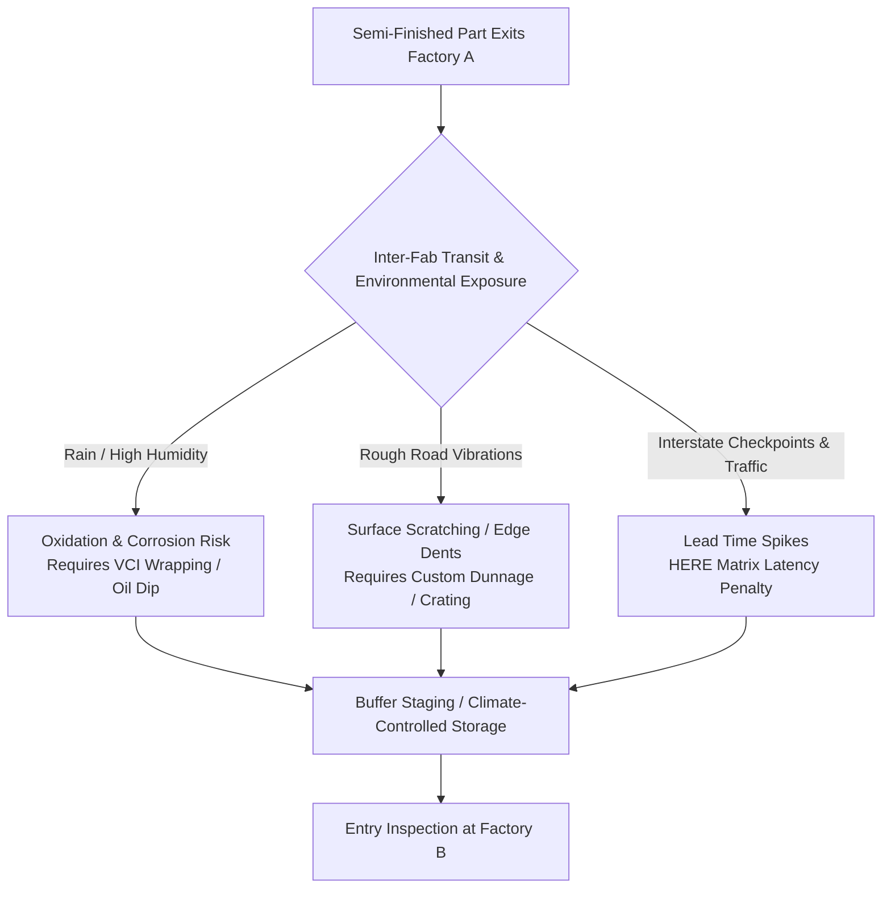
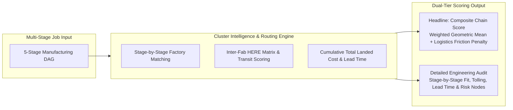

# DFN Multi-Stage Process Routing & Manufacturing DAG Architecture

## Executive Summary

Real-world industrial manufacturing is rarely a single-shot, point-to-point operation. Producing complex components—such as oilfield valves, agricultural implement assemblies, automotive structural parts, or precision electrical enclosures—demands a multi-stage sequence of discrete operations. These encompass raw substrate procurement, primary forming, precision subtractive machining, thermal metallurgy, surface passivation/coating, and stringent non-destructive quality audits.

In Nigeria and across Africa, specialized capabilities are frequently distributed across different facilities and industrial clusters (e.g., casting in Abeokuta $\rightarrow$ CNC machining in Ikeja $\rightarrow$ heat treatment in Agbara $\rightarrow$ zinc electroplating in Oshodi).

This document establishes the architecture for DFN Discovery's **Multi-Stage Process Routing & Factory Cluster Intelligence Engine**. It shifts Discovery from a flat, single-stage string match (`process_type = "machining"`) into an industrial **Directed Acyclic Graph (DAG)** orchestration system capable of modeling material transformations, tooling parameters, inter-fab Work-In-Progress (WIP) logistics, and multi-facility cluster routing.

---

## 1. Manufacturing Process as a Directed Acyclic Graph (DAG)

In Discovery's evolved data model, a manufacturing job is represented as an acyclic graph $G = (V, E)$, where:
- **Vertices ($V$)**: Discrete manufacturing operations or stages (e.g., Raw Stock Prep, CNC Milling, Heat Treatment, Anodizing, CMM Inspection).
- **Edges ($E$)**: Physical material transformations and inter-stage Work-In-Progress (WIP) transfers (including transit time, intermediate packaging, buffer storage, and environmental risk constraints).

```mermaid
flowchart LR
    subgraph Stage1["Stage 1: Substrate Preparation"]
        S1_Node["Alloy Billet / Stock<br/>6061-T6 Aluminum<br/>ASTM B221 / NIS 102"]
    end

    subgraph Stage2["Stage 2: Primary Subtractive Machining"]
        S2_Node["5-Axis CNC Milling<br/>Roughing & Semi-Finish<br/>Feeds/Speeds, Coolant: Semi-Synth"]
    end

    subgraph Stage3["Stage 3: Thermal Metallurgy"]
        S3_Node["Vacuum Heat Treatment<br/>Solution Heat & Artificial Aging<br/>Hardness: 95 HRB"]
    end

    subgraph Stage4["Stage 4: Surface Finishing"]
        S4_Node["Type III Hard Anodize<br/>MIL-A-8625 / ISO 7599<br/>Film Thickness: 50µm"]
    end

    subgraph Stage5["Stage 5: Quality Inspection & Release"]
        S5_Node["CMM Dimensional & NDT<br/>Surface Roughness Ra 0.8µm<br/>Final Sign-off"]
    end

    S1_Node -->|"Edge 1-2: Internal Transfer<br/>Raw Stock Handling"| S2_Node
    S2_Node -->|"Edge 2-3: Inter-Fab Transit<br/>WIP Anti-Corrosion Wrap<br/>Transit: Ikeja to Agbara (42 km)"| S3_Node
    S3_Node -->|"Edge 3-4: Inter-Fab Transit<br/>Post-Heat De-stress<br/>Transit: Agbara to Oshodi (38 km)"| S4_Node
    S4_Node -->|"Edge 4-5: Final Delivery Transit<br/>Protected Crating"| S5_Node
```

---

## 2. Granular Stage & Operation Specifications

Each stage node ($v \in V$) contains precise physical and metallurgical engineering parameters:

### 2.1 Substrates & Raw Materials
- **Material Family & Alloy Grade**: Specific designation (e.g., Aluminum `6061-T6`, Structural Steel `ASTM A36 / S275JR`, Stainless `AISI 316L`, Polymer `PA66-GF30`).
- **Form Factor & Dimensions**: Billet diameter, sheet gauge, extrusion profile, casting rough envelope.
- **Material Traceability & Provenance**: Requirement for Mill Test Certificates (MTC / EN 10204 3.1), scrap-melt percentage, or certified ingot source.
- **Storage Sensitivity**: Hygroscopic moisture limits for engineering polymers, humidity/oxidation thresholds for untreated carbon steel.

### 2.2 Tooling, Kinematics, Feeds & Speeds
- **Machine Class & Kinematics**: 3-Axis vs 5-Axis CNC, bed travel limits ($X, Y, Z$ envelope), maximum spindle speed (RPM), spindle power (kW).
- **Tooling Requirements**: Custom carbide endmills, form cutters, custom dies/molds, EDM wire diameter, clamping fixtures.
- **Feeds & Operating Parameters**: Feed per tooth ($f_z$), cutting speed ($v_c$), depth of cut ($a_p$), coolant chemistry (flood, mist, cryogenic).
- **Setup Costs & Tool Wear Consumables**: Setup/changeover hours, consumable wear rates amortized over batch volume.

### 2.3 Thermal & Surface Treatments
- **Thermal Cycles**: Austenitizing temperature, soak duration, quenching medium (water, oil, pressurized nitrogen gas), tempering/aging cycles.
- **Surface Engineering**: Anodizing (Type II sulfuric, Type III hardcoat), electroplating (zinc, nickel, chrome), phosphating, powder coating, sandblasting/shot-peening ($R_a$ finish specification).

### 2.4 Quality Inspection & Tolerancing Gates
- **Geometric Dimensioning & Tolerancing (GD&T)**: Linear tolerances (e.g., $\pm 0.012\text{ mm}$), true position, flatness, concentricity.
- **Non-Destructive Testing (NDT)**: Dye penetrant testing (PT), magnetic particle testing (MT), ultrasonic inspection (UT), X-ray radiography.
- **Mechanical Testing**: Rockwell/Vickers hardness verification, tensile yield tests, coating thickness eddy-current testing.

---

## 3. Work-In-Progress (WIP) Logistics & Intermediate Constraints

When operations are split across multiple facilities, intermediate transitions ($e \in E$) represent physical risk, lead time, and cost:

### 3.1 Transit Degradation & Preservation Rules
- **Corrosion & Moisture Sensitivity**: Freshly machined ferrous metals or untreated aluminum alloys suffer rapid surface oxidation during transit in humid tropical environments (e.g., Lagos, Port Harcourt). Transitions mandate protective measures:
  - *VCI (Vapor Corrosion Inhibitor) bags*
  - *Temporary oil/wax dipping*
  - *Desiccant packaging*
- **Maximum Queue Time (MQT)**: Maximum allowable window between stages before intermediate degradation occurs (e.g., parts must be anodized within 48 hours of final machining to prevent passive oxide layer inconsistency; heat-treated parts must be stress-relieved within 4 hours of quenching).

### 3.2 Inter-Fab Logistics Optimization via HERE Services
The **Geo & Logistics Service** computes transit metrics for every edge in the process graph:
- **HERE Matrix Routing v8**: Computes point-to-point transit times and toll/freight costs between Factory A and Factory B.
- **HERE Routing v8**: Evaluates route road quality, avoiding unpaved corridors that induce mechanical vibration damage on delicate components.
- **Buffer Storage Sizing**: Recommends buffer warehouse staging if Factory B's intake capacity is out of sync with Factory A's output cycle.

---

## 4. Multi-Factory Cluster Matching & Scoring Engine

Discovery's Core Intelligence calculates both **High-Level Headline Metrics** for decision-makers and **Granular Stage Breakdowns** for manufacturing engineers and auditors.

### 4.1 Theoretical Foundation & Derivation

The Headline Composite Chain Score ($S_{\text{chain}}$) is derived from two established operational frameworks:
1. **Multi-Attribute Utility Theory (MAUT) & Weighted Product Model (WPM)** (Bridgman, 1922; Miller & Starr, 1960):
   - In serial multi-stage manufacturing, an **arithmetic weighted mean** ($\sum w_i S_i$) suffers from the *fatal compensation flaw*—a catastrophic failure at an intermediate bottleneck stage ($S_3 = 0$) could still produce an acceptable arithmetic score ($\sim 75$), creating false positives for unfeasible supply chains.
   - The **Weighted Geometric Mean** enforces *non-compensatory serial dependence* (analogous to Leontief production functions and serial system reliability $R_{\text{system}} = \prod_{i=1}^n R_i$). If any critical stage exhibits poor capability fit, the geometric product penalizes the entire composite score disproportionately.
2. **Spatial Interaction & Transport Friction Theory** (Wilson, 1971; Spatial Gravity Models):
   - Physical handoffs across distributed factories incur friction of distance, mechanical shock, and environmental degradation. The spatial impedance factor $(1 - \sum P_{\text{logistics}})$ attenuates the ideal manufacturing score based on intermediate transit risks.

---

### 4.2 Mathematical Formulation & Parameter Definitions

The composite headline chain fit score is defined as:

$$S_{\text{chain}} = \left( \prod_{i=1}^{n} S_{\text{stage}, i}^{w_i} \right)^{\frac{1}{\sum_{i=1}^n w_i}} \times \left( 1 - \sum_{j=1}^{n-1} P_{\text{logistics}, j} \right)$$

Where:

#### 1. Stage Fit Score ($S_{\text{stage}, i} \in [0, 100]$)
Computed for the candidate factory assigned to stage $i$ using Core Intelligence's capability evaluation:

$$S_{\text{stage}, i} = \left( \sum_{k} \alpha_k \cdot C_{k, i} \right) \times (1 - \lambda_{\text{penalty}} \cdot N_{\text{missing\_evidence}})$$

- $C_{\text{process}}$ ($\alpha_1 = 0.30$): Machine kinematics match (spindle speed, 3/5-axis travel envelope, furnace chamber volume, plating tank size).
- $C_{\text{material}}$ ($\alpha_2 = 0.25$): Metallurgical compatibility (alloy grade certification, hardness capability, MTC / EN 10204 3.1 availability).
- $C_{\text{tolerance}}$ ($\alpha_3 = 0.25$): Precision gate (GD&T linear tolerance class, surface roughness $R_a$, CMM / NDT audit equipment).
- $C_{\text{compliance}}$ ($\alpha_4 = 0.20$): SDO certification alignment (ISO 9001, NIS/SONCAP, ASME Sec VIII/IX, API Q1).
- $\lambda_{\text{penalty}} = 0.15$: 15% confidence reduction per unverified mandatory capability field ($N_{\text{missing\_evidence}}$).

#### 2. Criticality Weight ($w_i > 0$)
Calibrated by the process stage's geometric sensitivity, rework difficulty, and scrap value accumulation:

| Stage Process Classification | Weight Range ($w_i$) | Engineering Justification |
|---|---|---|
| **High-Precision Subtractive Machining** (5-axis CNC, EDM, precision grinding) | **$2.0 – 2.5$** | Irreversible material removal, tight GD&T tolerances ($\pm 0.01\text{ mm}$), high value-add. |
| **Thermal Metallurgy & Heat Treatment** (Vacuum quenching, induction hardening) | **$1.5 – 1.8$** | Bulk metallurgical phase changes; improper cycles scrap the entire batch irreversibly. |
| **Surface Engineering & Functional Passivation** (Hard anodizing, nickel/chrome plating) | **$1.2 – 1.5$** | Dimensional buildup, corrosion barrier, adhesion test requirements. |
| **Substrate / Billet Procurement & Raw Prep** (Saw cutting, rough casting, billet stock) | **$0.8 – 1.0$** | High availability, lower processing precision, standard stock tolerances. |
| **Final Packaging, Staging & Release Inspection** (CMM audit, NDT sign-off, crating) | **$1.0 – 1.2$** | Gatekeeper stage verifying all prior transformations. |

#### 3. Logistics Friction & Risk Penalty ($P_{\text{logistics}, j} \in [0, 0.35]$)
For the intermediate transit edge $e_j = (v_j, v_{j+1})$ between Factory $j$ and Factory $j+1$, the edge risk is the sum of four orthogonal physical degradation vectors:

$$P_{\text{logistics}, j} = \min\Big(0.35, \; P_{\text{distance}, j} + P_{\text{roughness}, j} + P_{\text{degradation}, j} + P_{\text{delay}, j}\Big)$$

1. **Distance & Corridor Impedance ($P_{\text{distance}, j}$)**:
   $$P_{\text{distance}, j} = \min\left(0.12, \; \frac{d_j}{d_{\text{corridor\_ref}}} \times 0.08\right)$$
   Where $d_j$ is the HERE Matrix Routing v8 haulage distance (km) and $d_{\text{corridor\_ref}} = 300\text{ km}$ is the baseline regional logistics corridor limit.
2. **Road Roughness & Vibration Damage Risk ($P_{\text{roughness}, j}$)**:
   $$P_{\text{roughness}, j} = 0.05 \times f_{\text{unpaved}, j} \times \chi_{\text{fragility}}$$
   Where $f_{\text{unpaved}, j} \in [0, 1]$ is the fraction of unpaved or severely degraded road on route $j$ (from HERE Road Attributes API), and $\chi_{\text{fragility}} \in [0.5, 2.0]$ reflects part geometry vulnerability (e.g., thin-walled aerospace fins = 1.8, solid steel shafts = 0.6).
3. **Environmental Degradation & Oxidation Risk ($P_{\text{degradation}, j}$)**:
   $$P_{\text{degradation}, j} = \mu_{\text{material}} \times \left( \frac{t_{\text{transit}, j}}{T_{\text{MQT}, j}} \right) \times (1 - \delta_{\text{preservation}})$$
   Where:
   - $\mu_{\text{material}}$ is material oxidation sensitivity (e.g., untreated carbon steel = 0.08, 6061-T6 bare aluminum = 0.04, 316L stainless = 0.01).
   - $t_{\text{transit}, j} / T_{\text{MQT}, j}$ is transit duration relative to Maximum Queue Time before oxide/contamination threshold.
   - $\delta_{\text{preservation}} = 0.85$ when active preservation (VCI wrapping, oil dip, desiccant crates) is mandated on the edge.
4. **Corridor Delay & Checkpoint Bottleneck Risk ($P_{\text{delay}, j}$)**:
   $$P_{\text{delay}, j} = \min\left(0.10, \; \frac{t_{\text{congested}} - t_{\text{free\_flow}}}{t_{\text{free\_flow}}} \times 0.04 + 0.02 \times N_{\text{state\_crossings}}\right)$$
   Derived from HERE Traffic API real-time vs free-flow latency and number of inter-state transit checkpoints.

---

### 4.3 Worked Numerical Example

Consider the 4-stage precision aluminum assembly detailed below:

- **Stage 1 (Raw Billet)**: $S_{\text{stage}, 1} = 88$, Weight $w_1 = 1.0$
- **Stage 2 (5-Axis CNC Milling)**: $S_{\text{stage}, 2} = 94$, Weight $w_2 = 2.0$
- **Stage 3 (Vacuum Heat Treatment)**: $S_{\text{stage}, 3} = 91$, Weight $w_3 = 1.5$
- **Stage 4 (Type III Hard Anodize)**: $S_{\text{stage}, 4} = 86$, Weight $w_4 = 1.2$

$$\sum_{i=1}^4 w_i = 1.0 + 2.0 + 1.5 + 1.2 = 5.7$$

#### Step 1: Compute Weighted Geometric Mean of Stage Fits
$$\bar{S}_{\text{stages}} = \left( 88^{1.0} \times 94^{2.0} \times 91^{1.5} \times 86^{1.2} \right)^{\frac{1}{5.7}}$$
$$\ln(\bar{S}_{\text{stages}}) = \frac{1.0 \cdot \ln(88) + 2.0 \cdot \ln(94) + 1.5 \cdot \ln(91) + 1.2 \cdot \ln(86)}{5.7} = \frac{4.4773 + 9.0868 + 6.7663 + 5.3452}{5.7} = \frac{25.6756}{5.7} = 4.5045$$
$$\bar{S}_{\text{stages}} = e^{4.5045} \approx 90.42$$

#### Step 2: Calculate Edge Logistics Friction Penalties
- **Edge 1-2 (Abeokuta $\rightarrow$ Ikeja, 78 km)**: $P_{\text{dist}} = 0.015$, $P_{\text{rough}} = 0.002$, $P_{\text{degrade}} = 0.001$ (dry raw stock), $P_{\text{delay}} = 0.000 \implies P_{\text{logistics}, 1} = \mathbf{0.018}$ (1.8%)
- **Edge 2-3 (Ikeja $\rightarrow$ Agbara, 42 km)**: $P_{\text{dist}} = 0.008$, $P_{\text{rough}} = 0.001$, $P_{\text{degrade}} = 0.001$ (VCI protected), $P_{\text{delay}} = 0.002$ (Lagos corridor traffic) $\implies P_{\text{logistics}, 2} = \mathbf{0.012}$ (1.2%)
- **Edge 3-4 (Agbara $\rightarrow$ Oshodi, 38 km)**: $P_{\text{dist}} = 0.006$, $P_{\text{rough}} = 0.001$, $P_{\text{degrade}} = 0.000$ (de-stressed alloy), $P_{\text{delay}} = 0.001 \implies P_{\text{logistics}, 3} = \mathbf{0.008}$ (0.8%)

$$\sum_{j=1}^3 P_{\text{logistics}, j} = 0.018 + 0.012 + 0.008 = \mathbf{0.038} \quad (3.8\% \text{ total friction})$$

#### Step 3: Compute Final Headline Score
$$S_{\text{chain}} = 90.42 \times (1 - 0.038) = 90.42 \times 0.962 = \mathbf{86.98} \implies \mathbf{87 / 100}$$

---

### 4.4 Tier 2: Detailed Stage-by-Stage Engineering Audit Breakdown

For procurement engineers and quality auditors, Discovery renders a full node-by-node audit trail:

| Stage # | Operation | Assigned Factory | Stage Fit Score | Criticality ($w_i$) | Direct Stage Cost (₦) | Lead Time | Transit / Storage Edge to Next Stage | Edge Friction ($P_{\text{logistics}, j}$) |
|---|---|---|---|---|---|---|---|---|
| **01** | Raw Ingot Prep | AlumaTech Foundry (Abeokuta) | **88 / 100** | $w_1 = 1.0$ | ₦450,000 | 4 Days | 78 km to Ikeja (VCI crating required) | $P_1 = 1.8\%$ (Low) |
| **02** | 5-Axis CNC Milling | Precision Dynamics (Ikeja) | **94 / 100** | $w_2 = 2.0$ | ₦1,200,000 | 7 Days | 42 km to Agbara (Max Queue: 48 hrs) | $P_2 = 1.2\%$ (Moderate traffic) |
| **03** | Vacuum Heat Treat | ThermalPro Fabs (Agbara) | **91 / 100** | $w_3 = 1.5$ | ₦380,000 | 3 Days | 38 km to Oshodi (Protected pallets) | $P_3 = 0.8\%$ (Low) |
| **04** | Hard Anodize (50µm) | SurfaceTech Africa (Oshodi) | **86 / 100** | $w_4 = 1.2$ | ₦290,000 | 2 Days | 15 km to Final Assembly | $P_{\text{final}} = 0.0\%$ |
| **Total** | **End-to-End Chain** | **Composite Cluster** | **87 / 100 (Headline)** | $\sum w = 5.7$ | **₦2,320,000** | **16 Days** | **173 km Total Inter-Fab Transit** | **$\sum P = 3.8\%$ (Feasible)** |

---

## 5. Total Landed Cost (TLC) & Lead Time Accumulation

The multi-stage routing engine models the true economics of distributed manufacturing:

$$\text{TLC} = \sum_{i \in V} \left( C_{\text{setup}, i} + C_{\text{cycle}, i} \cdot Q + C_{\text{tooling}, i} \right) + \sum_{e \in E} \left( C_{\text{freight}, e} + C_{\text{preservation}, e} + C_{\text{buffer\_storage}, e} \right) + C_{\text{yield\_scrap}}$$

Where:
- $C_{\text{setup}, i}$: Setup, fixture mounting, and programming costs for stage $i$.
- $C_{\text{cycle}, i} \cdot Q$: Direct machine-hour run costs multiplied by job volume $Q$.
- $C_{\text{tooling}, i}$: Tool wear and custom tooling amortisation.
- $C_{\text{freight}, e}$: Road transport freight between factories $j$ and $j+1$.
- $C_{\text{preservation}, e}$: Cost of anti-corrosion VCI packaging, desiccants, or protective crates.
- $C_{\text{buffer\_storage}, e}$: Holding and staging costs in transit warehouses.
- $C_{\text{yield\_scrap}}$: Statistical yield loss accumulation across multi-vendor handoffs.
