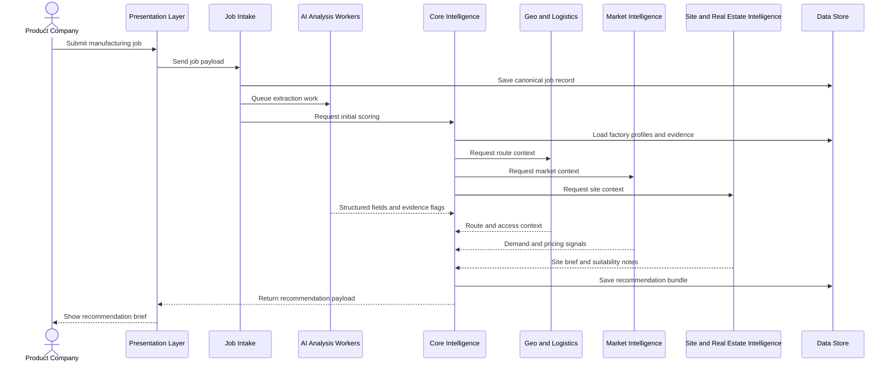
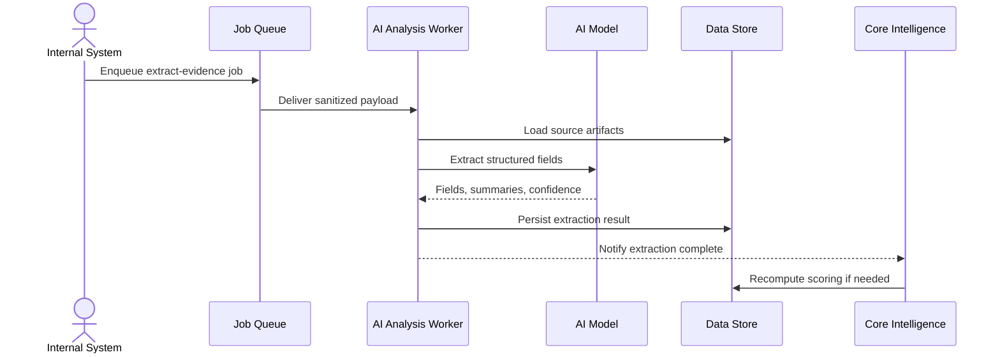

# DFN Sequence Diagrams

## Job Submission To Recommendation

## AI Extraction Worker

## Notes

- These diagrams assume the AI worker is isolated from the user interface.
- The presentation layer only orchestrates and renders, it does not decide the result.
- If a context service fails, the core score can still return with caveats, but it must label the gap.
