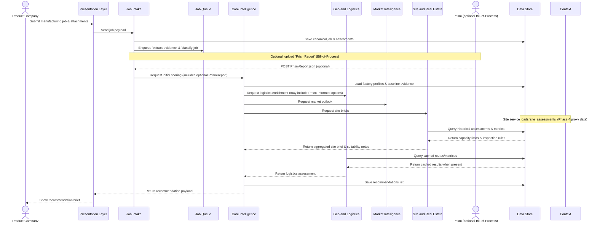
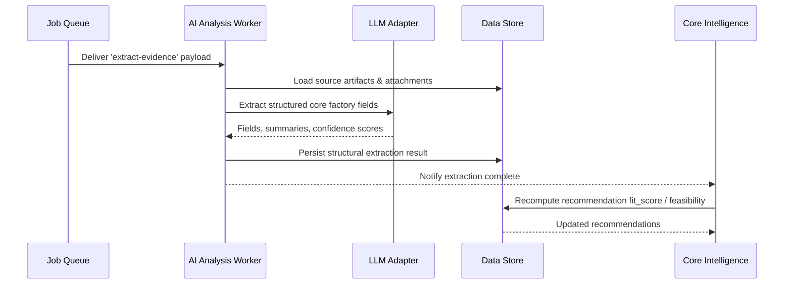
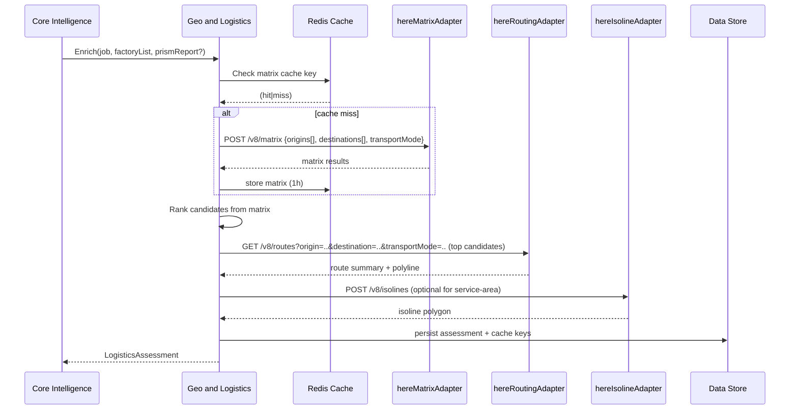
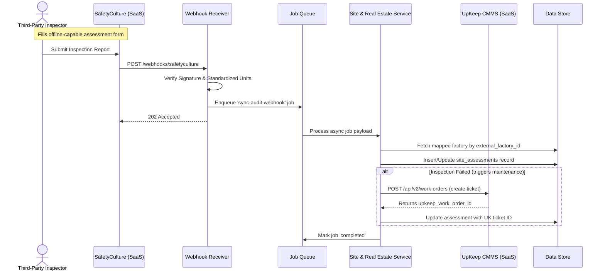

# DFN Sequence Diagrams (Comprehensive)

## 1. End-to-End Job Submission & Recommendation Flow

This diagram depicts the main product lifecycle, demonstrating how an incoming job is processed, how asynchronous extraction is queued, and how various context services—including Phase 4's Site & Real Estate records—fuel the final recommendation.

```mermaid
sequenceDiagram
    actor Company as Product Company
    participant UI as Presentation Layer
    participant Intake as Job Intake
    participant Queue as Job Queue
    participant Core as Core Intelligence
    participant Geo as Geo and Logistics
    participant Market as Market Intelligence
    participant Site as Site and Real Estate
    actor Prism as Prism (optional Bill-of-Process)
    participant DB as Data Store

    Company->>UI: Submit manufacturing job & attachments
    UI->>Intake: Send job payload
    Intake->>DB: Save canonical job & attachments
    Intake->>Queue: Enqueue 'extract-evidence' & 'classify-job'
    Note over Intake, Prism: Optional: upload `PrismReport` (Bill-of-Process)
    Prism-->>Intake: POST PrismReport.json (optional)
    Intake->>Core: Request initial scoring (includes optional PrismReport)
    Core->>DB: Load factory profiles & baseline evidence
    Core->>Geo: Request logistics enrichment (may include Prism-informed options)
    Core->>Market: Request market outlook
    Core->>Site: Request site briefs
    Note over Context, DB: Site service loads 'site_assessments' (Phase 4 proxy data)
    Site->>DB: Query historical assessments & metrics
    DB-->>Site: Return capacity limits & inspection rules
    Site-->>Core: Return aggregated site brief & suitability notes
    Geo->>DB: Query cached routes/matrices
    DB-->>Geo: Return cached results when present
    Geo-->>Core: Return logistics assessment
    Core->>DB: Save recommendations list
    Core-->>UI: Return recommendation payload
    UI-->>Company: Show recommendation brief
```

## 2. Unified Asynchronous Processing (AI Extraction)

This illustrates how the isolated internal `job_queue` ensures resilience for heavy AI ingestion tasks decoupled from the main user path.

```mermaid
sequenceDiagram
    participant Queue as Job Queue
    participant Worker as AI Analysis Worker
    participant Model as LLM Adapter
    participant DB as Data Store
    participant Core as Core Intelligence

    Queue->>Worker: Deliver 'extract-evidence' payload
    Worker->>DB: Load source artifacts & attachments
    Worker->>Model: Extract structured core factory fields
    Model-->>Worker: Fields, summaries, confidence scores
    Worker->>DB: Persist structural extraction result
    Worker-->>Core: Notify extraction complete
    Core->>DB: Recompute recommendation fit_score / feasibility
    DB-->>Core: Updated recommendations
```

## 3. Geo / Logistics Adapter Call Sequence

This diagram shows the recommended call ordering inside the `Geo and Logistics` service when enriching a recommendation. Matrix lookups are preferred for many-origin comparisons; routing is preferred for detailed shapes and ETA for top candidates; isoline is optional for service-area checks.

```mermaid
sequenceDiagram
    participant Core as Core Intelligence
    participant Geo as Geo and Logistics
    participant Cache as Redis Cache
    participant Mx as hereMatrixAdapter
    participant Rt as hereRoutingAdapter
    participant Iso as hereIsolineAdapter
    participant DB as Data Store

    Core->>Geo: Enrich(job, factoryList, prismReport?)
    Geo->>Cache: Check matrix cache key
    Cache-->>Geo: (hit|miss)
    alt cache miss
        Geo->>Mx: POST /v8/matrix {origins[], destinations[], transportMode}
        Mx-->>Geo: matrix results
        Geo->>Cache: store matrix (1h)
    end
    Geo->>Geo: Rank candidates from matrix
    Geo->>Rt: GET /v8/routes?origin=..&destination=..&transportMode=.. (top candidates)
    Rt-->>Geo: route summary + polyline
    Geo->>Iso: POST /v8/isolines (optional for service-area)
    Iso-->>Geo: isoline polygon
    Geo->>DB: persist assessment + cache keys
    Geo-->>Core: LogisticsAssessment
```

## 4. SaaS Proxy & Webhook Data Sync Flow (UpKeep / SafetyCulture)

This captures the Phase 4 proxy architecture showing how third-party field auditors supply the `site_assessments` that the Core Intelligence engine relies on above.

```mermaid
sequenceDiagram
    actor TP as Third-Party Inspector
    participant SC as SafetyCulture (SaaS)
    participant API as Webhook Receiver
    participant Queue as Job Queue
    participant SR as Site & Real Estate Service
    participant UK as UpKeep CMMS (SaaS)
    participant DB as Data Store

    Note over TP,SC: Fills offline-capable assessment form
    TP->>SC: Submit Inspection Report
    SC->>API: POST /webhooks/safetyculture
    API->>API: Verify Signature & Standardized Units
    API->>Queue: Enqueue 'sync-audit-webhook' job
    API-->>SC: 202 Accepted
    
    Queue->>SR: Process async job payload
    SR->>DB: Fetch mapped factory by external_factory_id
    SR->>DB: Insert/Update site_assessments record
    
    alt Inspection Failed (triggers maintenance)
        SR->>UK: POST /api/v2/work-orders (create ticket)
        UK-->>SR: Returns upkeep_work_order_id
        SR->>DB: Update assessment with UK ticket ID
    end
    
    SR->>Queue: Mark job 'completed'
```

## Notes

- **Queue As The Backbone:** Both inbound external webhooks (Phase 4) and internal AI analysis heavy-lifting (Phase 2/3) rely entirely on the `job_queue` to protect the Core engine from timeout failures.
- **Context Isolation:** The Core engine never talks strictly to SafetyCulture; it asks the `Site` service, which relies purely on synchronized native DB `site_assessments`.
- **Gradual Precision:** AI workers update the DB out of band, quietly re-triggering the Core intelligence so the UI receives progressively smarter matches over time.
