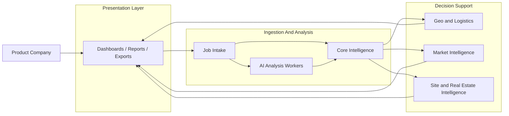
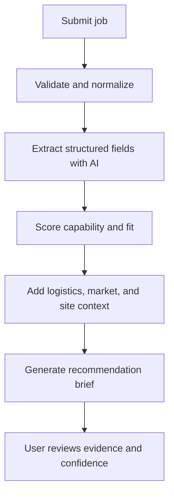

# DFN Service Map

## Product Goal

DFN Gap Analyzer helps product companies decide whether a manufacturing job can be routed to a Nigerian factory with acceptable cost, lead time, capability fit, and operational risk.

This is not a general chat product. The system should ingest structured and semi-structured inputs, compute scores, and return decision-ready outputs.

## System Shape

The product should be built as a small set of cooperating services with one thin presentation layer.

## Main Repo Integration Boundary

DFN Gap Analyzer should remain a standalone runtime and data boundary.

It may integrate with the main DFN repo through versioned contracts and identity, but it should not share live application state, local databases, or unversioned internal modules.

Shared between repos:

- authentication identity and role claims through a common identity provider
- versioned API contracts and client types
- optional shared design tokens or UI primitives when they are published as a package

Not shared between repos:

- database tables or migrations
- session storage or local user state
- direct runtime imports from the main repo application code
- queue state or worker state

Integration should happen through explicit interfaces:

- authenticated API calls from one app to the other
- webhook or event payloads for asynchronous updates
- a versioned shared package for types, constants, and client helpers

## Mermaid Views

### Service Architecture

### Request Flow

### Core Services

| Service | Owns | Main Inputs | Main Outputs |
|---|---|---|---|
| Job Intake | New job submissions, validation, normalization | Product requirements, files, form inputs, survey data | Canonical job record, validation errors |
| Core Intelligence | Process taxonomy, capability scoring, fit analysis | Canonical job record, factory profiles, market signals | Fit score, constraints, recommendation candidates |
| AI Analysis Workers | Extraction, summarization, explanation, anomaly flagging | Sanitized structured payloads | Structured fields, briefs, evidence summaries |
| Geo and Logistics | Travel distance, route costs, accessibility context | Job location, factory location, logistics constraints | Route options, travel time, cost estimates |
| Market Intelligence | Demand signals, pricing signals, capacity signals | Research feeds, survey data, partner data | Market score, trend signals, risk notes |
| Site and Real Estate Intelligence | Facility briefs, location suitability, access context | Candidate sites, proximity data, property data | Site briefs, site scores, notes |
| Presentation Layer | Dashboards, reports, exports, filters | All upstream service outputs | User-facing views, downloadable reports |

## Service Boundaries

### 1. Job Intake Service

This service should accept messy input from product teams and turn it into a single canonical job record.

Owns:

- form validation
- file ingestion
- survey ingestion
- deduplication
- source tracking

Does not own:

- scoring
- recommendation logic
- AI interpretation

### 2. Core Intelligence Service

This is the decision engine.

Owns:

- manufacturing process taxonomy
- material compatibility rules
- manufacturing capability model
- fit scoring
- confidence scoring
- recommendation ranking

Should be mostly deterministic, with AI assisting only where the input or explanation needs structure.

### 3. AI Analysis Workers

These jobs should run in isolation and receive sanitized inputs only.

They should not chat with users.

Use cases:

- classify a job into process and material buckets
- extract entities from documents and surveys
- summarize a factory or site into a brief
- explain why one option ranks higher than another
- flag missing, conflicting, or low-confidence data

### 4. Geo and Logistics Service

Owns:

- route estimation
- proximity analysis
- travel time and cost estimation
- map overlays

This service should stay separate because it will evolve on different data, performance needs, and vendor dependencies.

### 5. Market Intelligence Service

Owns:

- demand signals
- pricing signals
- capacity signals
- access-to-market indicators

This service feeds the core engine and the final reports.

### 6. Site and Real Estate Intelligence Service

Owns:

- site briefs
- facility fit analysis
- access context
- rent and infrastructure notes where data is available

This should be a distinct module because site selection is a different buying question from factory matching.

### 7. Presentation Layer

Owns:

- dashboards
- saved comparisons
- exports
- report generation
- filters and search

This layer should be thin. It should render and orchestrate, not decide.

### 8. Main Repo Integration Layer

This is not a separate business service. It is the boundary that keeps DFN Gap Analyzer decoupled while still allowing it to consume upstream identity, contracts, and optional shared UI assets from the main DFN repository.

Owns:

- contract validation for inbound and outbound integration payloads
- adapter code for shared identity and upstream data fetches
- version checks for shared package compatibility

Does not own:

- persistent business data
- user-facing decision logic
- schema definitions for the main repo

## Primary Data Flow

1. Product company submits a manufacturing job.
2. Job Intake validates and normalizes the request.
3. AI Analysis Workers extract structure from messy text and attachments.
4. Core Intelligence scores fit against factory and process data.
5. Geo and Logistics adds route and access context.
6. Market Intelligence adds demand and market context.
7. Site and Real Estate Intelligence adds location suitability.
8. Presentation Layer combines the outputs into a decision brief.

If the main DFN repo needs to participate, it should do so before or after these steps through the integration boundary above, not by embedding its logic inside the Gap Analyzer service stack.

The user should see a recommendation, supporting evidence, and confidence level.

## HLD Decisions

These need to be locked before low-level design starts.

1. What is the canonical job schema?
2. What is the canonical factory profile schema?
3. Which score is primary, fit score or feasibility score?
4. What is the minimum evidence required before a recommendation can be shown?
5. What is computed synchronously, and what runs asynchronously?
6. Which outputs can be generated by rules, and which need AI?

## LLD Workstreams

These are the first low-level design slices to define.

### Job Intake

- request payload
- validation rules
- file types and limits
- idempotency
- job status states

### Core Intelligence

- scoring formula
- feature weights
- confidence calculation
- ranking tie-breakers
- fallback behavior when data is incomplete

### AI Workers

- prompt contract
- sanitized input schema
- output schema
- retry policy
- refusal policy for missing data

### Geo and Logistics

- route request schema
- location normalization
- provider abstraction
- caching rules
- fallback when map data is partial

### Market Intelligence

- signal source model
- freshness rules
- confidence levels
- source provenance

### Site and Real Estate Intelligence

- site brief schema
- proximity scoring
- site ranking inputs
- missing-data handling

## AI Rules

AI should be used in isolation, with minimal sanitized prompting from the user.

Preferred modes:

- structured extraction
- summarization from verified data
- ranking explanation
- anomaly detection
- brief generation

Avoid:

- freeform chatbot UI
- long conversational back-and-forth
- ungrounded answers
- prompt chains that depend on the user explaining everything manually

## Suggested First Release Shape

The first release should focus on one narrow flow:

1. Submit a manufacturing job.
2. Normalize and classify it.
3. Score it against known factories and capabilities.
4. Return a recommendation brief with evidence.

Everything else should support that flow.

## Open Questions

1. What is the canonical factory profile?
2. What data do we trust enough to score against on day one?
3. What are the minimum fields required for a useful recommendation?
4. Which outputs must be explainable to the user from the start?

## Planning Pack

- [High-Level Design](DFN_HLD.md)
- [Low-Level Design](DFN_LLD.md)
- [Sequence Diagrams](DFN_SEQUENCE_DIAGRAMS.md)
