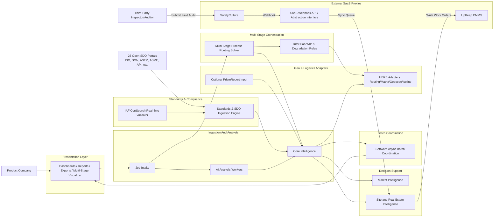
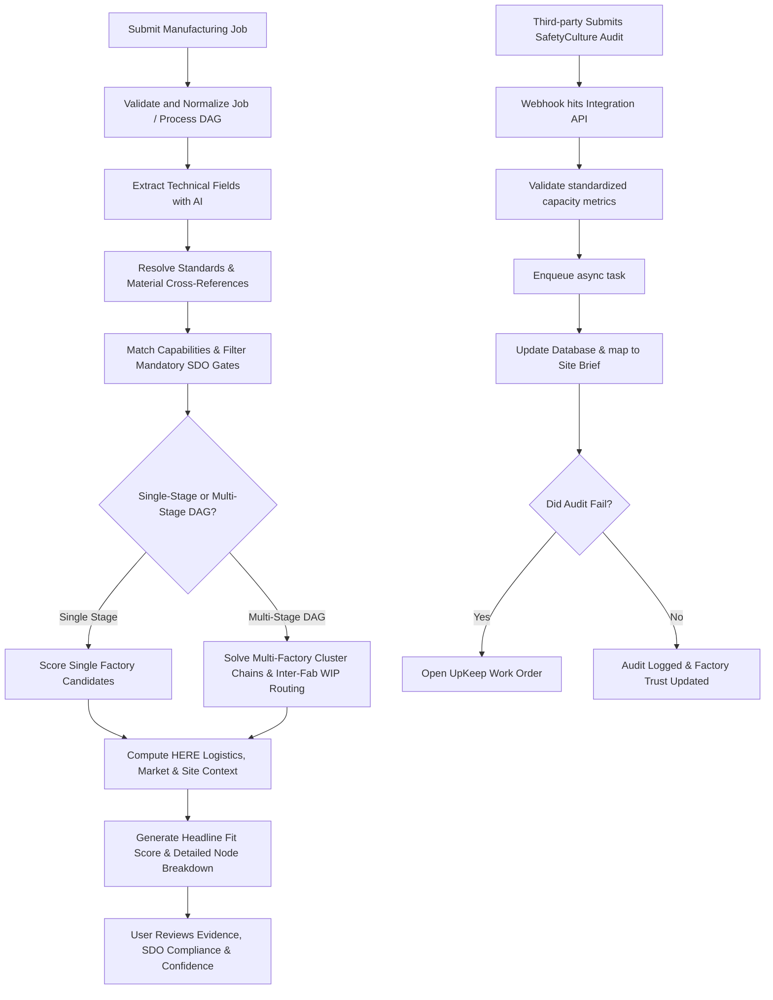

# DFN Service Map

## Product Goal

DFN Discovery helps product companies decide whether a manufacturing job can be routed to a Nigerian factory or multi-factory cluster with acceptable cost, lead time, capability fit, standard compliance, and operational risk.

This is not a general chat product. The system ingests structured and semi-structured inputs, evaluates multi-stage process DAGs, checks SDO standards compliance, computes deterministic scores, and returns decision-ready outputs.

## System Shape

The product is built as a set of cooperating backend services with one thin presentation layer.

## Main Repo Integration Boundary

DFN Discovery remains a standalone runtime and data boundary.

It integrates with the main DFN repo through versioned contracts and identity, but does not share live application state, local databases, or unversioned internal modules.

Shared between repos:

- authentication identity and role claims through a common identity provider (JWT via JWKS)
- versioned API contracts and client types
- optional shared design tokens or UI primitives when published as a package

Not shared between repos:

- database tables or migrations
- session storage or local user state
- direct runtime imports from main repo application code
- queue state or worker state

---

## Mermaid Views

### Service Architecture

```mermaid
flowchart LR
 U[Product Company]
 IF[Third-Party Inspector/Auditor]
 SDO_Feeds[25 Open SDO Portals<br/>ISO, SON, ASTM, ASME, API, etc.]

 subgraph P[Presentation Layer]
  UI[Dashboards / Reports / Exports / Multi-Stage Visualizer]
 end

 subgraph I[Ingestion And Analysis]
  JI[Job Intake]
  AI[AI Analysis Workers]
  CI[Core Intelligence]
 end

 subgraph SDO[Standards & Compliance]
  SE[Standards & SDO Ingestion Engine]
  IAF_Val[IAF CertSearch Real-time Validator]
 end

 subgraph MSR[Multi-Stage Orchestration]
  DAG[Multi-Stage Process Routing Solver]
  WIP[Inter-Fab WIP & Degradation Rules]
 end

 subgraph B[Batch Coordination]
  BC[Software Async Batch Coordination]
 end

 subgraph D[Decision Support]
  MI[Market Intelligence]
  SR[Site and Real Estate Intelligence]
 end

 subgraph H[Geo & Logistics Adapters]
  HR[HERE Adapters: Routing/Matrix/Geocode/Isoline]
  PR[Optional PrismReport Input]
 end

 subgraph E[External SaaS Proxies]
  UK[UpKeep CMMS]
  SC[SafetyCulture]
  API[SaaS Webhook API / Abstraction Interface]
 end

 U --> UI
 UI --> JI
 JI --> AI
 JI --> DAG
 SDO_Feeds --> SE
 IAF_Val --> SE
 SE --> CI
 DAG --> WIP
 WIP --> HR
 DAG --> CI
 AI --> CI
 CI --> HR
 PR --> CI
 CI --> MI
 CI --> SR
 CI --> BC
 BC --> UI
 
 IF -- Submit Field Audit --> SC
 SC -- Webhook --> API
 API -- Sync Queue --> SR
 SR -- Write Work Orders --> UK
```

### Request Flow (Multi-Stage & Single-Stage)

```mermaid
flowchart TB
 A[Submit Manufacturing Job] --> B[Validate and Normalize Job / Process DAG]
 B --> C[Extract Technical Fields with AI]
 C --> D[Resolve Standards & Material Cross-References]
 D --> E[Match Capabilities & Filter Mandatory SDO Gates]
 E --> F{Single-Stage or Multi-Stage DAG?}
 F -- Single Stage --> G[Score Single Factory Candidates]
 F -- Multi-Stage DAG --> H[Solve Multi-Factory Cluster Chains & Inter-Fab WIP Routing]
 G --> I[Compute HERE Logistics, Market & Site Context]
 H --> I
 I --> J[Generate Headline Fit Score & Detailed Node Breakdown]
 J --> K[User Reviews Evidence, SDO Compliance & Confidence]
 
 L[Third-party Submits SafetyCulture Audit] --> M[Webhook hits Integration API]
 M --> N[Validate standardized capacity metrics]
 N --> O[Enqueue async task]
 O --> P[Update Database & map to Site Brief]
 P --> Q{Did Audit Fail?}
 Q -- Yes --> R[Open UpKeep Work Order]
 Q -- No --> S[Audit Logged & Factory Trust Updated]
```

---

## Core Services

| Service | Owns | Main Inputs | Main Outputs |
|---|---|---|---|
| **Job Intake** | New job submissions, validation, normalization, DAG parsing | Product requirements, CAD/BOM files, form inputs, survey data | Canonical job record, process stage graph, validation errors |
| **Core Intelligence** | Process taxonomy, capability scoring, fit analysis, cluster chain solving | Canonical job record, process stages, factory profiles, market signals | Fit score, feasibility score, confidence metrics, recommendation candidates |
| **Standards & SDO Engine** | Open SDO ingestion (25 sources), SON OPAC sync, international cross-references, IAF validation | SDO metadata feeds, NIS/NCP bulk CSVs, factory certification numbers | `standards_catalog`, `standard_cross_references`, verified accreditation status |
| **Multi-Stage Process Routing** | Manufacturing DAG decomposition, tooling parameters, substrate constraints, cluster composition | Process stages, tolerances, machine classes, feed/speed limits | Factory cluster routing, inter-fab transit legs, stage-by-stage engineering breakdown |
| **AI Analysis Workers** | Extraction, summarization, explanation, anomaly flagging | Sanitized structured payloads, uploaded technical specs | Structured fields, briefs, evidence summaries |
| **Geo and Logistics** | Travel distance, route costs, reachability, accessibility context, inter-fab transit | Job location, factory locations, transit preservation rules | Route options, transit matrices, road vibration risk, isolines (via HERE Adapters) |
| **Geo Adapters** | Thin HTTP adapters and cache layer for HERE services | Coordinates, profile opts, cached keys | Normalized route/matrix/geocode/isoline shapes; cache-aware responses |
| **Market Intelligence** | Demand signals, pricing signals, capacity signals | Research feeds, survey data, trade stats (UN Comtrade/World Bank) | Market score, trend signals, risk notes |
| **Site and Real Estate Intelligence** | Facility briefs, location suitability, access context | Candidate sites, proximity data, property data | Site briefs, site scores, notes (via UpKeep & SafetyCulture) |
| **Batch Coordination** | Bulk API request orchestration, grouped calculations, aggregate status | Batch manifests, child job outputs, service results | Batch status, rollups, partial-failure summaries (software async execution plane) |
| **Presentation Layer** | Dashboards, reports, exports, filters, DAG visualizer | All upstream service outputs | User-facing views, downloadable reports, interactive multi-fab chain maps |

---

## Service Boundaries

### 1. Job Intake Service
Accepts messy input from product teams and creates a canonical job record and optional process graph.
- Owns: Form validation, file ingestion, DAG structure validation, deduplication, source tracking.
- Does not own: Scoring, recommendation ranking, standards compliance decisions.

### 2. Core Intelligence Service
The deterministic decision engine.
- Owns: Manufacturing process taxonomy, material compatibility rules, capability scoring, cluster chain optimization, confidence scoring.
- Incorporates standards adherence as hard feasibility gates and confidence multipliers.

### 3. Standards & SDO Engine
Maintains the engineering standards catalog and accreditation registries.
- Owns: Ingestion pipelines for 25 open SDOs, SON OPAC scheduled scraper, admin bulk NIS imports, cross-reference mapping (e.g. NIS 102 $\leftrightarrow$ ASTM A36), and real-time IAF CertSearch validation.
- Does not own: Factory scoring formulas.

### 4. Multi-Stage Process Routing Service
Deconstructs multi-step manufacturing workflows into Directed Acyclic Graphs.
- Owns: Substrate and alloy temper modeling, tooling & machine kinematics constraints, thermal/surface treatment rules, inter-stage WIP transitions, Maximum Allowable Queue Times (MQT), and tropical corrosion preservation policies.
- Does not own: Direct map rendering.

### 5. Geo and Logistics Service
Calculates spatial and physical transit metrics.
- Owns: Provider adapters for HERE Routing, Matrix Routing, Geocoding, and Isoline APIs; inter-fab transit matrices; road roughness risk; buffer warehouse staging estimates.

### 6. AI Analysis Workers
Isolated background workers operating on sanitized inputs.
- Owns: Classifying jobs into process/material buckets, extracting technical clauses from drawings, summarizing factory briefs, explaining ranking differences, flagging missing or contradictory requirements.

### 7. Batch Coordination Service (Software Control Plane)
Coordinates bulk API submissions and async queue worker sets.
- Owns: Batch manifests, idempotency keys, progress rollups, partial failure/retry handling for bulk requests.
- Does not own: Physical manufacturing batch/lot sizing or production planning.

### 8. Presentation Layer
Thin UI layer rendering dashboards, reports, and interactive multi-fab process maps.
- Owns: User views, exports, comparisons, stage-by-stage node visualizers.
