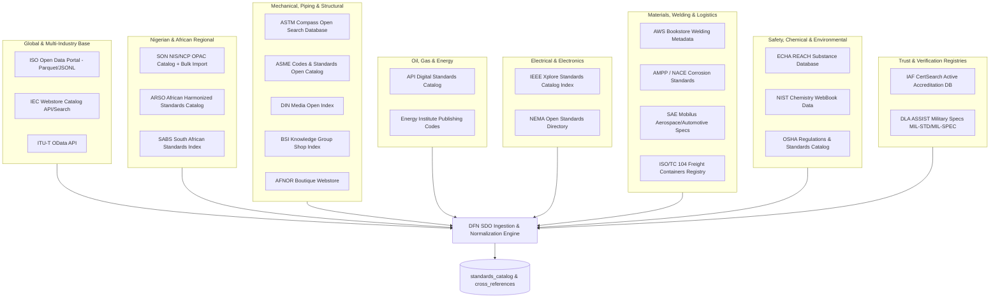
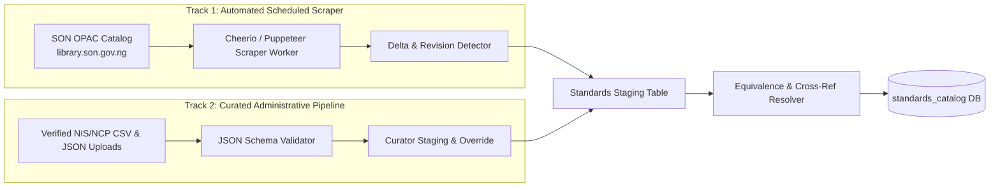
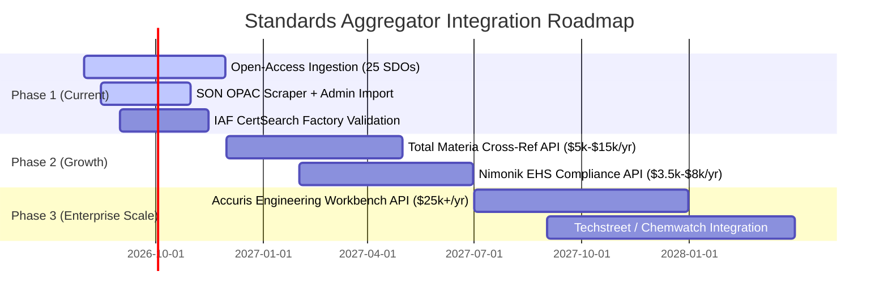
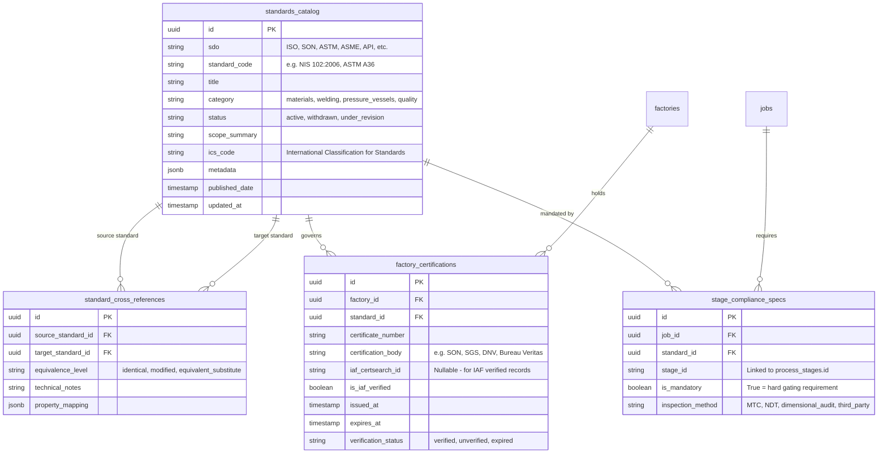

# DFN Standards & SDO Architecture

## Executive Summary

Engineering and manufacturing in Nigeria and the broader African continent operate at the intersection of international codes and localized compliance mandates. Industrial projects across infrastructure, oil & gas, mining, automotive, agricultural machinery, and consumer products demand adherence to a diverse matrix of Standards Development Organizations (SDOs)—including British Standards (BSI), European Norms (EN), American Standards (ASTM, ASME, API), International Standards (ISO, IEC), and regional/national frameworks like ARSO and the Standards Organisation of Nigeria (SON).

This document establishes the architectural specification for DFN Discovery's **Standards & SDO Compliance Engine**. It details:
1. **25 Open-Access SDO Catalogs & Metadata Feeds** for immediate, zero-license-cost ingestion.
2. **Dual-Track Ingestion for Nigerian Standards (SON)**: Automated OPAC scraping + curated CSV/JSON bulk imports.
3. **Commercial Aggregator API Strategy & Cost Models** (Accuris, Total Materia, Techstreet, etc.) for future scale.
4. **Relational Data Modeling & Cross-Referencing** to map local Nigerian Industrial Standards (NIS) directly to international equivalents (ISO, ASTM, DIN).
5. **Scoring & Verification Engine Integration** to gate and weight factory capabilities and job requirements.

---

## 1. Global & Regional SDO Taxonomy (25 Open-Access Sources)

While full-text standards documents are typically paywalled by SDOs, standard codes, titles, revisions, withdrawal statuses, technical committee scopes, and abstracts are openly accessible. Discovery indexes this metadata to validate job compliance requirements and verify factory capabilities.

### 1.1 Source Breakdown & Ingestion Endpoints

| Category | SDO / Entity | Key Standards Covered | Ingestion Method / Endpoint | Primary Relevance in Nigeria |
|---|---|---|---|---|
| **Global Base** | **ISO** | ISO 9001, ISO 14001, ISO 13485, ISO 3834 | Open Data Portal (Bulk Parquet / JSONLines sync) | Core baseline for quality management & export validation |
| **Global Base** | **IEC** | IEC 60034 (Motors), IEC 61439 (Switchgear) | Webstore Search Index sitemaps / periodic crawler | Electrical grid, solar mini-grids, industrial automation |
| **Global Base** | **ITU-T** | Cabling, Optical Transmission, Telecom infra | OData API feed (`itu.int`) | Fiber rollout, data centers, telecoms towers |
| **Nigerian Regional** | **SON (Standards Organisation of Nigeria)** | NIS (Nigerian Industrial Standards), NCP (Codes of Practice) | Dual Track: OPAC Scraping (`library.son.gov.ng`) + CSV/JSON bulk import | **Mandatory** for statutory compliance, MANCAP, SONCAP |
| **African Regional** | **ARSO** | African Harmonized Standards (ARS) | ARSO Web Catalog crawler | Cross-border trade under AfCFTA, regional export rules |
| **African Regional** | **SABS** | SANS (Structural steel, mining specs) | SABS Public Webstore Index | Mining equipment, heavy fabrication, southern corridor trade |
| **Mechanical / Structural** | **ASTM** | ASTM A36 (Steel), ASTM B221 (Aluminum), ASTM D3965 | Public Search Index API / Metadata Scraper | Materials testing, metallurgy, plastics & resin specs |
| **Mechanical / Structural** | **ASME** | BPVC (Boiler & Pressure Vessel), B31.3 (Process Piping) | Codes & Standards digital catalog | Boilers, pressure vessels, refinery piping, gas skids |
| **Mechanical / Structural** | **DIN** | DIN EN ISO equivalents, machining tolerances (DIN 7168) | DIN Media Index crawler | Heavy machinery, European manufacturing equipment |
| **Mechanical / Structural** | **BSI** | BS EN 10025, BS 5950 | BSI Knowledge Shop metadata parser | Foundational civil, mechanical, and legacy engineering specs |
| **Mechanical / Structural** | **AFNOR** | NF standards, Eurocodes | AFNOR Webstore index | Cross-border Francophone trade (Benin, Togo, Ivory Coast) |
| **Oil & Gas** | **API** | API 5L (Line pipe), API 650 (Storage tanks), API 6D (Valves) | API Digital Catalog scraper | Nigerian upstream/downstream oil & gas, refinery fabrication |
| **Oil & Gas** | **Energy Institute (EI)** | EI 1581 (Aviation fuel), Downstream safety | EI Publishing catalog parser | Depot storage, jet fuel handling, distribution safety |
| **Electrical / Automation** | **IEEE** | IEEE 802, IEEE C37 (Switchgear) | IEEE Xplore Open Metadata Search API | Automation, microgrids, industrial control electronics |
| **Electrical / Automation** | **NEMA** | NEMA Enclosure types (NEMA 4X), Motors (MG 1) | NEMA Open Standards Directory | Industrial electrical enclosures, wet/dusty site operations |
| **Materials / Welding** | **AWS** | AWS D1.1 (Structural welding), AWS D1.6 (Stainless) | AWS Bookstore catalog crawler | Structural welding, tank fabrication, bridge & marine welding |
| **Materials / Welding** | **AMPP / NACE** | NACE MR0175/ISO 15156 (Sour service), SP0198 (Coatings) | AMPP Standards Catalog parser | Corrosion mitigation in Niger Delta oilfields & coastal marine |
| **Materials / Welding** | **SAE International** | SAE J429 (Bolts/Fasteners), Aerospace/Auto materials | SAE Mobilus open metadata search | Automotive assembly, fleet parts manufacturing, fasteners |
| **Materials / Welding** | **ISO/TC 104** | ISO 668, ISO 1496 (Freight container specs) | ISO Standards Directory (TC 104) | Modular containerized fabs, logistics transport skids |
| **Chemical / Safety** | **ECHA REACH** | Substance of Very High Concern (SVHC), RoHS lists | ECHA Open Data API / Downloads | Chemical manufacturing, electronics export compliance |
| **Chemical / Safety** | **NIST** | NIST Chemistry WebBook thermal/physical constants | Free REST API / ChemWebBook queries | Thermochemical modeling, fluid dynamics, raw resin specs |
| **Chemical / Safety** | **OSHA** | OSHA 1910 (General industry safety) | OSHA Regulations public API | Factory health & safety, hazardous material storage |
| **Trust & Verification** | **IAF CertSearch** | ISO 9001, ISO 14001, ISO 45001 active accreditations | IAF CertSearch Public Validation API | Verifying factory accreditation validity in real-time |
| **Defense / Robustness** | **DLA ASSIST** | MIL-STD-810 (Environmental), MIL-SPEC finishes | DLA ASSIST Open Database (Free Full Text) | Extreme environmental testing (heat, dust, humidity) |

---

## 2. Nigerian SDO (SON) Ingestion Strategy: The Dual-Track Engine

Because the Standards Organisation of Nigeria (SON) does not yet offer a public REST API with webhooks, Discovery implements a **Dual-Track Ingestion Pipeline**:

### Track 1: Automated OPAC Scraping Worker
- **Target**: `library.son.gov.ng/?t=catalogue-opac`
- **Execution**: Runs weekly as an asynchronous background worker (`sync-son-standards`).
- **Extracted Fields**: Standard Code (e.g., `NIS 102:2006`), Title, Abstract/Scope, Technical Committee (e.g., `TC 01 - Chemical Technology`), Status (Active / Under Review).
- **Error Handling**: Handles rate limits, transient network dropouts, and session cookies gracefully with exponential backoff.

### Track 2: Curated CSV/JSON Administrative Bulk Import
- **Purpose**: Fast-track ingestion of official gazetted SON catalogues, MANCAP guidelines, and mandatory NIS standards without relying on web scrapers.
- **Endpoint**: `POST /api/v1/admin/standards/bulk-import` (Protected by admin role).
- **Schema Validation**: Validates code formats, ICS classification codes, active dates, and linked international harmonizations (e.g., `NIS ISO 9001:2015`).

---

## 3. Commercial Standards Aggregators: Phased Roadmap & Cost Breakdown

When DFN Discovery scales to require **full-text standard parsing**, **automated AI requirement clause extraction**, and **materials grade cross-mapping**, commercial aggregator APIs will be integrated.

### 3.1 Aggregator Comparison Matrix

| Aggregator | Core Capability | SDO Coverage | Estimated Annual Cost | Discovery Integration Role |
|---|---|---|---|---|
| **Total Materia** | World's largest material property database; cross-references metals/polymers across 74 national SDOs | 74 SDOs (ASTM, DIN, BS, JIS, GB, ISO, etc.) | **$5,000 – $15,000 / year** | **High Priority (Phase 2)**: Resolves raw material substitutions (e.g., mapping imported European steel to local Nigerian scrap-melt rebar or ASTM A36). |
| **Nimonik** | EHS regulations, ISO management systems, localized environmental compliance | 80+ countries | **$3,500 – $8,000 / year** | **Medium Priority (Phase 2)**: Environmental and factory safety auditing in accordance with NESREA (Nigeria) and OSHA regulations. |
| **Accuris (Engineering Workbench)** | Unified API access to 400+ SDOs, revision webhooks, Parts API Gateway | 400+ SDOs | **$25,000+ / year** (Enterprise) | **Enterprise Milestone (Phase 3)**: Full-text standards clause injection into AI analysis workers for automated technical specification extraction. |
| **Techstreet (Clarivate)** | Full-text delivery, amendments tracking, lifecycle management | Broad (ASTM, API, ASME, BSI) | **$4,000 – $20,000+ / year** | Alternative to Accuris for oil & gas and mechanical piping specifications. |
| **Chemwatch** | Chemical safety data sheet (SDS) authoring, substance tracking, chemical logistics | Global chemical registries | **$4,000 – $12,000 / year** | Downstream oil & gas, paint/coating manufacturing, plastic masterbatch plants. |
| **SAI Global (Infostore)** | Quality management, European/Australian governance standards | ISO, EN, AS/NZS | **$5,000+ / year** | International certification tracking for export-grade products. |

---

## 4. Database Schema for Standards & Cross-Referencing

To enable seamless mapping between Nigerian NIS standards and their international ASTM/ISO counterparts, Discovery establishes the following normalized relational schema:

---

## 5. Standards in the Discovery Scoring Engine

Discovery's Core Intelligence utilizes standard compliance in a two-stage evaluation:

1. **Hard Gating (Feasibility Gate)**:
   - If a job specifies a mandatory standard (e.g., `API 5L Grade X52` or `ASME Section VIII Div 1`), any candidate factory lacking verified capability or holding expired certifications is either disqualified or flagged with a severe feasibility warning.
2. **Confidence & Fit Multiplier**:
   - Factories holding active, IAF-verified certifications (e.g., `ISO 9001:2015` verified via IAF CertSearch) receive an elevated `confidence_score` and `feasibility_score` boost over self-reported capabilities.
3. **Cross-Reference Substitution Engine**:
   - If a product specifies a European standard (`EN 10025-2 S275`), the cross-reference engine identifies equivalent materials available in the Nigerian market (`ASTM A36` or `NIS 102`), recalculating fit scores with clear engineering substitution caveats.
